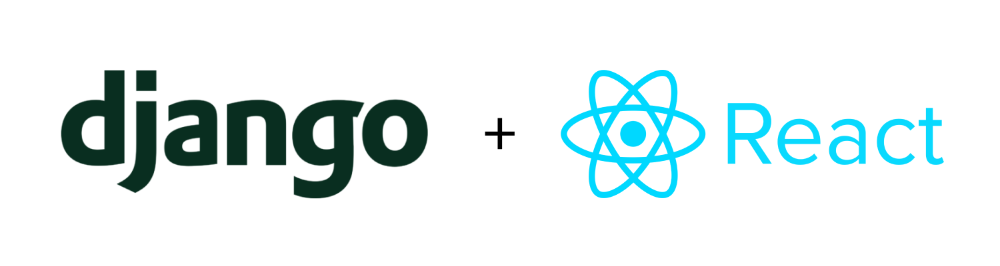

# Todo App

A project for learning purposes.

## Installation

```bash
# Clone the repository
git clone https://github.com/fatmakahveci/React-Django-Notes-App.git
```

```bash
# Go to the directory
cd React-Django-Notes-App
```

```bash
# Create a virtual environment
python3.11 -m venv env
```

```bash
# activate the virtual env
source env/bin/activate
```

```bash
# install packages
pip install -r requirements.txt
```

### Backend development workflow

```bash
cd backend
```

```bash
python manage.py migrate
```

```bash
python manage.py runserver
```

### Frontend development workflow

```bash
cd frontend
```

```bash
npm install
```

```bash
# You must be in the root folder where `package.json` is.
npm start
```

```bash
# For deployment
npm run build
```

---

- You can check my Django notes in [my blog](https://fatmakahveci.com/coding/django/).
